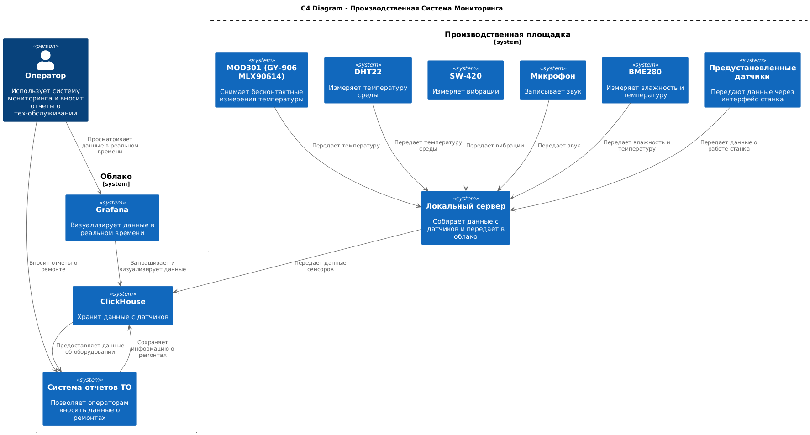
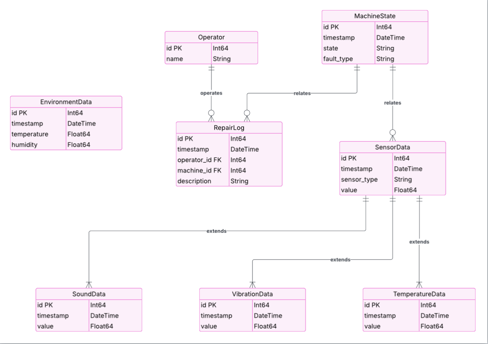

# Этап 2. Проектирование системы машинного обучения

- Определите структуру данных для анализа

    см диаграмму классов

- Спроектируйте архитектуру

    более подробно о выбранных моделях будет в следующем этапе.

- Опишите, как данные поступают с оборудования в систему.

    на территории производства находится простой сервер, к которому подключены все датчики. Этот сервер подключен к сети интернет и передает данные в развернутый в облаке кликхаус

    

    [puml](diagram/c4.puml)

- Какие ключевые элементы системы нужны
    - датчики
    - сервер на производтсве
    - облако с системой хранения данных, системой мониторинга

- Хранилище данных. ER диаграмма:

    

## Ещё немного диаграмм

Диаграмма потоков данных

[puml](diagram/data_flow.puml)

Диаграмма классов

[puml](diagram/classes.puml)
 
Диаграмма последовательности

 
 [puml](diagram/sequence.puml)
