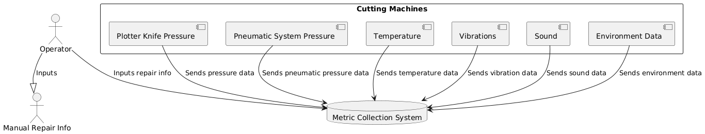
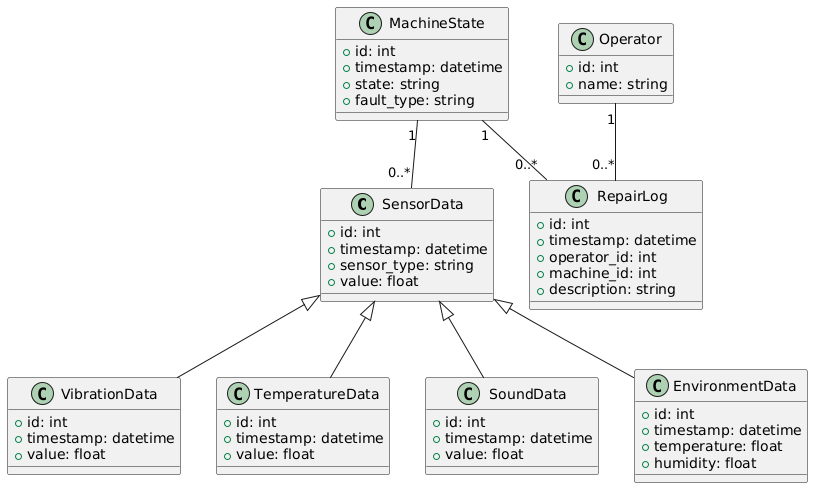
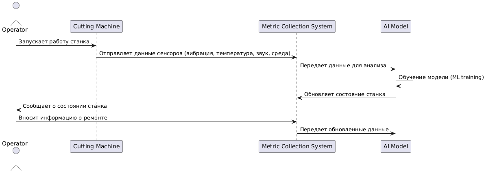

### Этап 2. Проектирование системы машинного обучения
- Определите структуру данных для анализа
- Спроектируйте архитектуру
- Опишите, как данные поступают с оборудования в систему.
- Какие ключевые элементы системы нужны
- Уровни архитектуры
- Хранилище данных.
- Модуль анализа (ML-модель).
- Интерфейс для отображения прогнозов.

#### Выходные артефакты - Диаграммы

Диаграмма потоков данных

[puml](diagram/data_flow.puml)

Диаграмма классов

[puml](diagram/classes.puml)
 
Диаграмма последовательности

 
 [puml](diagram/sequence.puml)

 
